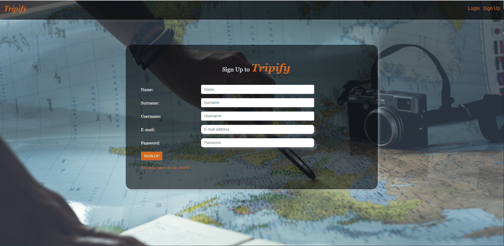
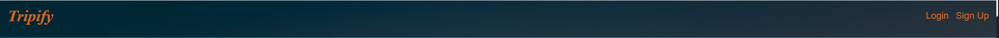
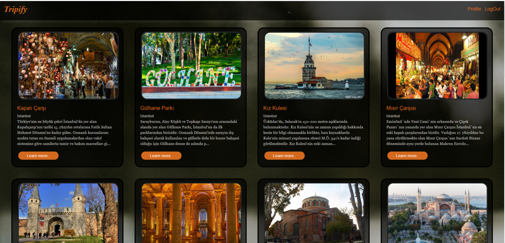
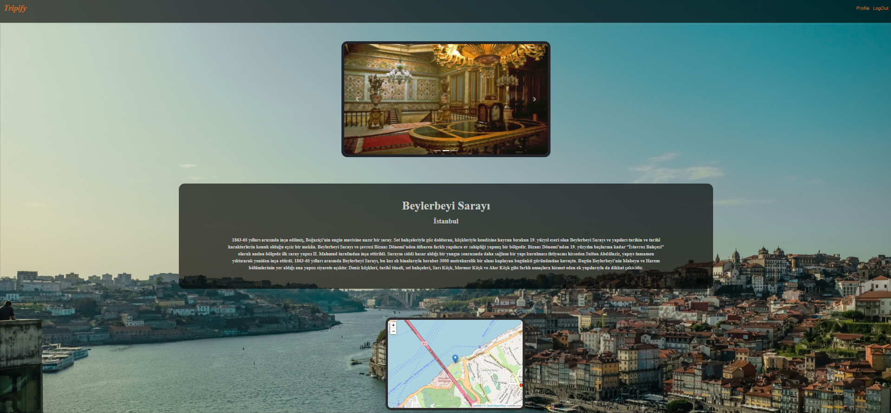
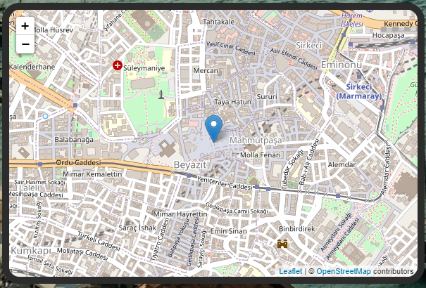
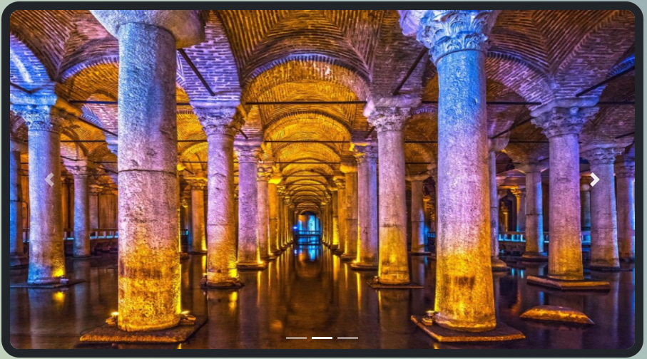
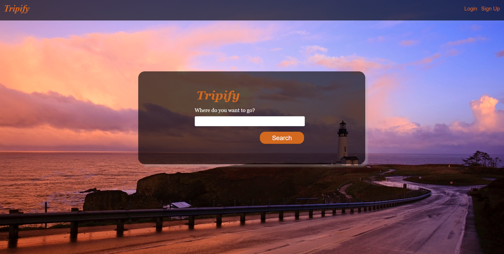
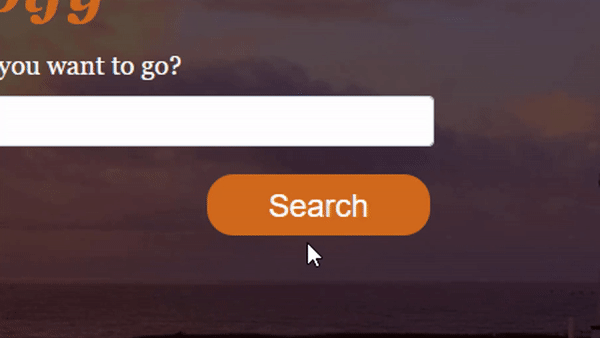

# 2020 Bootcamp Team 10 - `Six Musketeers`

## Team Members

| Role               | Name      |
|--------------------|-----------|
| Backend Developer, DB Architecture and QA(Test Developer)  | A. Yavuz ORUÇ  |
| Frontend Developer | Derya Taşdöğen |
| Frontend Developer | Ahmet Genç  |
| Frontend Developer | Ahmetcan Yazıcı  |

| xxxxxxxx Developer | İsmail   |
| xxxxxxxx Developer | Ayşe  |

## Project

  ## Purpose/Project Proposal
  The project for "Turkey's Cultural places listing and pinning in a Map" is a Maven - Spring Boot MVC project. This Web project was developed using the Java software language. JDK 8 was used as the platform. In this project, MySQL Image was created using Docker. Tables were created in Localhost using SQL query language in Sequelpro. HQL query language is used for database query. Hibernate was used as an ORM tool.

  ## Software Language/ Project Environment

    Platform : Java Development Kit 8
    Framework : Spring Boot
    IDE : Eclipse or IntelliJ
    Database : MySQL
    Query Language : SQL - HQL
    ORM Framework : Hibernate
    Frontend : React – HTML – CSS
    Other Tools : Docker – Postman - VS Code

##Backend
    ### Steps
    
    1- Download JDK 11 or 8
    2- Download Eclipse or IntelliJ IDE
    3- Download Git
    4- users/.../git  create a folder(name doesnt matter) this path.
      4.1- git clone https://github.com/eteration-bootcamp/2020-bootcamp-team-10.git
    5- Go to IDE
      5.1- Import
      5.2- Existing Maven Project
      5.3- go to folder that you created and finish.
    6- IDE Build itself.
    7- Application.Java class is starter for project. If you click run button in this class you can see in your console window, that spring project starts.
    8-If you want to push your code on to repository.
      8.1- git status
      8.2- git add .
      8.3- git commit -m "bugfixes or something else"
      8.4- git push "origin" master/or your branch
    9- If you want to create SQL
      9.1- You can search for , "how can ı create mysql docker image"
      9.2- SequeLPro is so effective app for mysql
      9.3- You can connect your local host and create some tables.(CityId - CityName - CityDescription - CityPhoto- CulturalPlace -CityCoordinate)
      9.4- You can create db with code like below.
           
            CREATE TABLE `city` (
            `city_id` int(11) NOT NULL,
            `city_name` varchar(30) NOT NULL,
            `city_description` varchar(1500) NOT NULL,
            `city_photo1` varchar(30) NOT NULL,
            `city_photo2` varchar(30) ,
            `city_photo3` varchar(30) ,
            `cultural_place` varchar(30) NOT NULL,
            `city_coordinatesX` varchar(30) NOT NULL,
            `city_coordinatesY` varchar(30) NOT NULL,
             PRIMARY KEY (`city_id`)
             ) ENGINE=InnoDB DEFAULT CHARSET=utf8;

           CREATE TABLE `user` (
          `user_id` int(11) NOT NULL,
          `first_name` varchar(20) DEFAULT NULL,
          `last_name` varchar(20) DEFAULT NULL,
          `username` varchar(250) DEFAULT NULL,
          `password` varchar(20) DEFAULT NULL,
           PRIMARY KEY (`user_id`)
           ) ENGINE=InnoDB DEFAULT CHARSET=utf8;
      
      
      **If you want to ask question, you can write on discord.

      # Frontend

 This project is built on Boilerplate Template.
      Boilerplate: https://github.com/react-boilerplate/react-boilerplate

### Steps
    1-npm install
    2-npm run start/npm start


### Components

You can find the used components listed below:

| Plugin | README |
| ------ | ------ |
| 1 | LoginForm Component |
| 2 | SignUp Component |
| 3 | Header Component |
| 4 | CulturalPlaceList Component |
| 5 | DescriptionCard Component |
| 6 | Map Component |
| 7 | PhotoSlider Component |
| 8 | Search Component |


#### 1-LoginForm Component

This component is used in LoginPage Container for user actors to log in to Tripify. It fetches the POST method in signIn() function.

```ssh
signIn(event) {
   event.preventDefault();
   const data = new FormData(event.target);
   const reqBody = JSON.stringify({
     username: data.get('username'),
     password: data.get('password'),
   });
   try {
     fetch('http://localhost:7007/application/login', {
       method: 'POST',
       headers: {
         Accept: 'application/json, text/plain',
         'Content-Type': 'application/json;charset=UTF-8',
       },
       body: reqBody,
     })
       .then(response => response.json())
       .then(data => this.props.setAuth(data))
       .then(() => this.redirectToHome());
 
     if (this.props.userInfo.isLoggedIn == false) {
       this.setState({ loginFlag: 1 });
     }
   } catch (error) {
     console.log(error);
   }
```
LoginForm Props:

```ssh
LoginForm.propTypes = {
  userInfo: PropTypes.object,
  setAuth: PropTypes.func,
};
```
-userInfo and setAuth props are used for setting a state to transfer data for Redux.

Screenshot:


#### 2-SignUpForm Component
This component is used in SignUpPage Container for user actors to Sign Up to Tripify. It fetches the POST method in signUp() function.

```ssh
signUp(event) {
   event.preventDefault();
   const data = new FormData(event.target);
   const reqBody = JSON.stringify({
     firstName: data.get('name'),
     lastName: data.get('surname'),
     username: data.get('username'),
     password: data.get('password'),
   });
   try {
     fetch('http://localhost:7007/application/register/', {
       method: 'POST',
       headers: {
         'Content-Type': 'application/json',
       },
       body: reqBody,
     });
   } catch (error) {
     console.log(error);
   }
 }
```
SignUpForm Props:

-userInfo: PropTypes.object:  props are used for setting a state to transfer data for Redux.
-signUp = this.signUp.bind(this): to make click event clickable just once

Screenshot:



#### 3-Header Component
This component is used on every page as Navigation Bar(Navbar.js) in Tripify. NavBar changes after successful login. 

Header Props:

```ssh
Navbar.propTypes = {
  isLogin: PropTypes.object,
};
```
-isLogin prop is used for to keep the state for NavBar if there is a successful login event.

Screenshot:




#### 4-CulturalPlaceList Component

This component is used to list searched places after the search event. CulturalPlaceList Component gets FilteredPlaces array data from Search Component which was stored in Redux and sends this data information to SmallCardGrid.js as a prop to list (if there is anything to worth to be listed). If the user searches without writing anything on the field, this component will list every cultural place in its database.

CulturalPlaceList Props:

```ssh
CulturalPlaceList.propTypes = {
  data: PropTypes.object,
  setFilterData: PropTypes.func,
  noFoundMessage: PropTypes.string,
  undefinedMessage: PropTypes.string,
};
```
-data: This prop was used as placeData to send data to SmallCardGrid.js from homePage selector

Screenshot:




#### 5-DiscriptionCard Component
This component is used to get all detailed information about a cultural place. This component can be reached directly with URL address or after inside CulturalPlaceList Component’s any ‘Learn More…’  button. DescriptionCard Component contains Map and PhotoSlider Components.
DescriptionCard Props:
```
DescriptionCard.propTypes = {
    aPlaceData: PropTypes.object,
};
```
-aPlaceData: This prop gets data from redux/saga and carry the data to other components and inside itself.

Screenshot:



#### 6-Map Component

It is used to show the location of places to users. It takes aPlaceData state from DescriptionCard Component. It uses cityCoordinateX, cityCoordinatesY, cityName and culturalPlace features of data. In this way it shows place location in a map. In addition this component uses OpenStreetMap API and Leaflet to visualize data. 

🍃 Leaflet is an open-source JavaScript library for mobile-friendly interactive maps. We create a 'map' div, add tiles of our choice, and then add a marker for places.

```sh
<Container>
        <Row>
          <Col sm="12" md={{ size: 6, offset: 3 }}>
            <Map
              center={[
                this.coordinateParseFloat(
                  this.props.placeInfo[0].cityCoordinatesX,
                ),
                this.coordinateParseFloat(
                  this.props.placeInfo[0].cityCoordinatesY,
                ),
              ]}
              zoom={15}
            >
              <TileLayer
                url="https://{s}.tile.openstreetmap.org/{z}/{x}/{y}.png"
                attribution='&copy; <a href="http://osm.org/copyright">OpenStreetMap</a> contributors'
              />
 
              <Marker
                key={this.props.placeInfo.cityId}
                position={[
                  this.coordinateParseFloat(
                    this.props.placeInfo[0].cityCoordinatesX,
                  ),
                  this.coordinateParseFloat(
                    this.props.placeInfo[0].cityCoordinatesY,
                  ),
                ]}
                onClick={() => {
                  this.setPlacePoint(this.props.placeInfo[0]);
                }}
              />
 
              {this.state.placePoint && (
                <Popup
                  position={[
                    this.coordinateParseFloat(
                      this.props.placeInfo[0].cityCoordinatesX,
                    ),
                    this.coordinateParseFloat(
                      this.props.placeInfo[0].cityCoordinatesY,
                    ),
                  ]}
                  onClose={() => {
                    this.setPlacePoint(null);
                  }}
                >
                  <div>
                    <h2>{this.props.placeInfo[0].culturalPlace}</h2>
                    <p>{this.props.placeInfo[0].cityName}</p>
                  </div>
                </Popup>
              )}
            </Map>
          </Col>
        </Row>
      </Container>
```
Map Props:
```ssh
CulturalPlaceList.propTypes = {
    placeInfo: PropTypes.object.isRequired,
};
```
Screenshot:



#### 7-PhotoSlider Component
This component is to present a photo slide show animation inside DescriptionCard Component. It gets the data through DescriptionCard Component.

PhotoSlider Props:
```
PhotoSlider.propTypes = {
  	placeData: PropTypes.array,
    };
```
Screenshot:

   
    

#### 8-Search Component
This is the component to search for cultural places to go. You can easily access the information about the place you want to go by typing the name of the place you want to go to the search bar.

Search Probs:
```
Search.propTypes = {
  data: PropTypes.object,
  setFilterData: PropTypes.func,
};
```

Screenshot:

<br /><br />

Search Bar has some filtering. The searched data is transferred with the help of probs.

filterArray Function:
```
filterArray = () => {
    this.setState(prevState => {
      const searchString = prevState.query;
      const serviceResponse = this.props.data.culturalPlaces;
      let responseData;
      if (searchString.length > 1) {
        responseData = serviceResponse.filter(place =>
          place.culturalPlace
            .toLowerCase()
            .includes(searchString.toLowerCase()),
        );
      } else {
        responseData = this.props.data.culturalPlaces;
      }
      this.props.setFilterData(responseData);
      return { responseData };
    });
  };
```
<br />

This component is made using the reactstrap library elements Col, Row Form, FormGroup, Label, Input, Button, Toggle, Container.

```
import {
  Col,
  Row,
  Form,
  FormGroup,
  Label,
  Input,
  ButtonToggle,
  Container,
} from 'reactstrap';
```
<br />

In the container created, a background as shown in the figure was designed using special css structures. In addition, the coloring and placement has also been adjusted.

```
.searchContainer {
  position: relative;
  /* height: 300px; */
  padding-top: 3%;
  padding-bottom: 3%;
  padding-left: 0%;
  border-radius: 25px;
  top: 20%;
  width: 45%;
  font-size: 18px;
  background-color:rgba(0, 0, 0, 0.644) ;
  box-shadow: 10px 10px 5px #aaaaaa54;
}
```
<br />

The button created using Reactstrap has been given the form in the figure with additional css.

 

Button Css:

```
.button {
  border-radius: 20px;
  background-color: chocolate;
  border: none;
  color: #FFFFFF;
  text-align: center;
  font-size: 28px;
  padding: 2px;
  width: 61%;
  transition: all 0.5s;
  cursor: pointer;
  margin: 5px;
  margin-left: 12%;
}
.button-text {
  color:#FFFFFF;
  font-size: 85%;
}

.button span {
  cursor: pointer;
  display: inline-block;
  position: relative;
  transition: 0.5s;
}

.button span:after {
  content: '\00bb';
  position: absolute;
  opacity: 0;
  top: 0;
  right: -20px;
  transition: 0.5s;
}

.button:hover span {
  padding-right: 25px;
}

.button:hover span:after {
  opacity: 1;
  right: 0;
}
```
